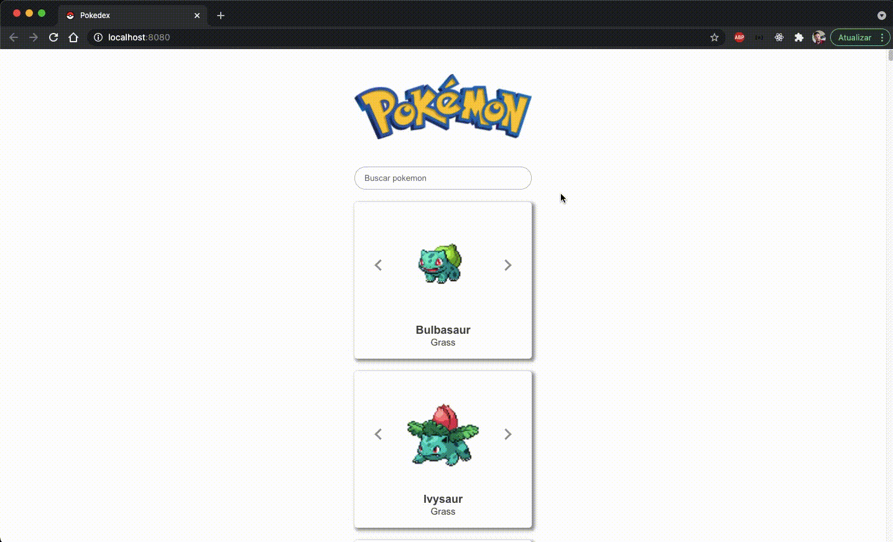

<h1 align="center">
  Pokedex
</h1>

<h1 align="center">
  
</h1>

## Indice
<p align="center">
  <a href="#bookmark-sobre">Sobre</a> |
  <a href="#computer-tecnologias-utilizadas">Tecnologias</a> |
  <a href="#dart-objetivo">Objetivo</a> |
  <a href="#gear-requisitos">Requisitos</a> |
  <a href="#package-como-baixar-o-projeto">Baixar</a> |
  <a href="#bust_in_silhouette-autor">Autor</a> |
  <a href="#pencil-licença">Licença</a>
</p>

## :bookmark: Sobre
Aplicação web para listar e buscar pokemons da primeira geração

## :computer: Tecnologias Utilizadas

Front-End
- <a href="https://pt-br.reactjs.org/">Vue.js</a>
- <a href="https://github.com/axios/axios">Axios</a>

API
- <a href="https://pokeapi.co/">Pokeapi</a>

## :dart: Objetivo
- Listar os pokemons
- Filtrar pokemons pelo campo de pesquisa

## :gear: Requisitos:
- Editor de código (recomendo o Visual Studio Code: https://code.visualstudio.com/)
- Node.js (https://nodejs.org/pt-br/)
- Yarn (https://classic.yarnpkg.com/en/docs/install/#mac-stable)

## :package: Como Baixar o projeto
Pelo seu terminal, escolha um local para o projeto e rode os comandos:
```bash
  # Clone o repositório
  $ git clone https://github.com/luizcampos331/pokedex-vue.git

  # Entre no diretório principal
  $ cd pokedex-vue

  # Instale as dependências
  $ yarn

  # Executar o projeto
  $ yarn serve
```

## :bust_in_silhouette: Autor:
Luiz Eduardo Campos da Silva</br>
LinkedIn: <a href="https://www.linkedin.com/in/luiz-campos">@luiz-campos</a></br>
Github: <a href="https://www.github.com/luizcampos331">@luizcampos331</a>


## :pencil: Licença
Copyright © 2020 <a href="https://www.github.com/luizcampos331">Luiz Campos</a></br>
Este projeto é licenciado pelo <a href="LICENSE">MIT</a>
